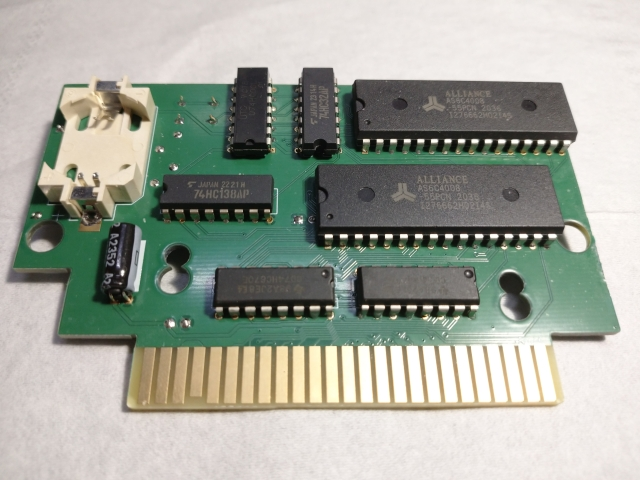
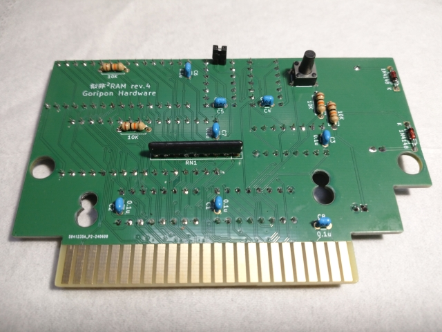

# ESE2-RAM Cartridge(1Mbyte Version)

[日本語版 README はこちら](README.md)




This is an MSX cartridge (named ESE-ESE-RAM or ESE2-RAM) that uses a general-purpose logic IC to realize the same operation as a mega ROM controller and uses it to construct ESE-RAM.
Created by Goripon Hardware (hardware division of doujin circle Goripon Software).

Schematic data, PCB data, and Gerber data for KiCAD7 are released under the Creative Commons license (CC-BY-NC).
[MGINST215.zip](https://github.com/goriponsoft/ESE2RAM-Cartridge-74670/blob/main/MGINST215.zip) and [KSAVER105.zip](https://github.com/goriponsoft/ESE2RAM-Cartridge-74670/blob/main/KSAVER105.zip) are not subject to CC license and are subject to their original license and terms.

X(old Twitter): @goriponsoft

## What is ESE-RAMDisk (ESE-RAM)?

This is a general-purpose backup RAM cartridge for MSX that can be used as storage, etc., devised by Mr. Tsujikawa of [Doujin Circle/ESE Artists' Factory](http://www.hat.hi-ho.ne.jp/tujikawa/ese/).

Usually, it is produced by modifying the game's mega ROM cartridge and replacing the ROM with RAM. You can use the MGINST command to install a DOS kernel and use it as an SSD-like storage (ESE-RAMDisk), or to write and run a MegaROM image.

Since it was originally devised to be used as storage, the cartridge itself is also more commonly referred to as "ESE-RAMDisk."

Please note that it is illegal to write and run images of games that you do not own. In addition to ESE-RAMDisk, it is usually used to run images of the original game cartridge that becomes unusable when modified to ESE-RAM (must be exported to a file before modification), freeware, self-made ROM games, etc. used for.

For more information about ESE-RAMDisk, see [ESE Artists' Factory's ESE-RAMDisk page](http://www.hat.hi-ho.ne.jp/tujikawa/ese/eseram.html)(Note: This page is in Japanese.).

## What is ESE2-RAM(ESE-ESE-RAM)?

In recent years, it has become difficult to obtain MSX games, and there was a lot of hesitation in replacing the precious Mega ROM cartridges with ESE-RAM. Therefore, we created this cartridge by using commonly available general-purpose logic ICs to create a circuit equivalent to a mega ROM controller, and using that to assemble ESE-RAM.

I named this cartridge "ESE-ESE-RAM" or "ESE2-RAM". "ESE2-RAM" originates from "ESE squared".

## Components
Note: After board Rev.6, U3 to U5 have been changed from 74HC series to 74AHC series.
|Part Number|Parts|Quantity|
|:--|:--|--:|
|BT1|CR2032 battery holder, Either "CH29-2032LF"/"CH28-2032LF(TR)"/"CH004-2032LF"/"CH004-2032LF"|1|
|C1-C8|Unpolarized capacitor, 100nF, 50V, 2.5mm pitch|8|
|C9|Polarized capacitor, 47uF, 16V|1|
|D1-D2|Diode "1N4148"|2|
|IC1-IC2|4Mbit SRAM(628512 type/512Kx8), DIP-32, "AS6C4008" etc.|2|
|R1-R4|Resistor 1/4W, 10K ohm|4|
|RN1|Resistor array 8 elements, 10K ohm, SIP-9|1|
|S1|6x6mm Through hole & ground terminal type tactile switch "TVDP01-095BB1"|1|
|U1-U2|General purpose logic IC "74HC670"|2|
|U3|General purpose logic IC "74AHC138"|1|
|U4|General purpose logic IC "74AHC00"|1|
|U5|General purpose logic IC "74AHC32"|1|
|-|CR2032 battery|1|

## How to assemble
Due to the mounting area of the board, components such as resistors, capacitors, and diodes are placed on the back side (solder side), so care must be taken when assembling.

1. Turn the board over (the side with "Front" written next to the connector is the front side) and place the components in the order of diodes, resistors, ceramic capacitors, and register array, referring to the silk printing. Please solder from the front side (component side). If you apply too much solder, there will be a gap between the IC and the board, so use a moderate amount of solder when soldering.
2. After soldering, cut off the excess leads on the surface. If there are any excess leads left, there will be a gap between the IC and the board, so please cut them as short as possible.
3. Turn the board over, place the IC, electrolytic capacitor, and ceramic capacitor, and solder from the back side (solder side) as usual. Mount the electrolytic capacitor horizontally in the direction of the silk printing (if mounted vertically, it will not fit into the cartridge shell). You can treat the IC and capacitor leads as usual.
4. Solder the tact switch and battery holder. As standard, the tactile switch is placed on the back side and the battery holder on the front side, but it can also be placed on the opposite side, so please place it as you like.
5. After carefully checking that there are no short circuits or incorrectly installed parts, insert it into the actual MSX machine and check the operation. Even if you are not using it as an ESE-RAMDisk, it is easy to use MGINST to check its operation.

## Preparation (When using as ESE-RAMDisk)
1. Obtain MGINST.COM and KSAVER.COM (You can download the LHA format archive from [ESE Artists' Factory unofficial home page](http://www.big.or.jp/~saibara/msx/ese/index.html). We also have [MGINST215.zip](https://github.com/goriponsoft/ESE2RAM-Cartridge-74670/blob/main/MGINST215.zip) and [KSAVER105.zip](https://github.com/goriponsoft/ESE2RAM-Cartridge-74670/blob/main/KSAVER105.zip) re-archived in ZIP format.)
2. Copy the above tools and the MSX-DOS system file (MSXDOS.SYS/COMMAND.COM) to some kind of MSX-bootable storage (usually a floppy disk). When using the MSX-DOS2 kernel, if you also copy the MSX-DOS2 system file (MSXDOS2.SYS/COMMAND2.COM), it will be automatically copied when ESE-RAM is installed and it will start up with MSX-DOS2. You will be able to do this.
3. Insert the ESE2-RAM cartridge into the actual MSX machine, turn on the power while holding down the tact switch, and start MSX-DOS (or MSX-DOS2) from the storage created in step 2.
4. Save the MSX-DOS or MSX-DOS2 kernel to a file from the MSX console using KSAVER.COM (see the KSAVER documentation for details).
5. Install the ESE-RAM kernel using MGINST.COM and specifying the kernel file you saved in step 4 (see the MGINST documentation for details).
6. Make sure to reset and boot from ESE-RAMDisk.

The kernel file saved in step 4 is not needed, so you can delete it. Leaving it in will allow you to skip the step when reinstalling ESE-RAMDisk.

If an error occurs in step 5, there is a high possibility that the parts are poorly soldered, so please check the board.

## How to use (When running Mega ROM software)
Due to the functions of the parts used, in this cartridge, the initial value of the segment (bank number) is an undefined value unlike the ASCII mapper, so it is essential to initialize the segment register (bank number register) by program.
Most Mega ROM software, including ESE-RAMDisk and games, initialize properly so there is no problem, but software that neglects initialization or expects the initial segment value to be a specific value may not work.

Immediately after starting or resetting this cartridge, the bank is as follows.

|Bank Address|Register Address|Bank Number|
|:--|:--|--:|
|4000h-5FFFh|6000h-67FFh|0|
|6000h-7FFFh|6800h-6FFFh|0|
|8000h-9FFFh|7000h-77FFh|0|
|A000h-BFFFh|7800h-7FFFh|0|

The 74HC670 IC used for the segment number register in this cartridge does not have a function to reset its value, so all segment numbers will be undefined immediately after startup (or the value immediately before the reset in the case of a reset). Therefore, to ensure that the ROM header with segment number 0 correctly appears at 4000h-5FFFh, the cartridge has a mechanism whereby all banks are fixed at segment number 0 until the first write is made to a register address after startup.

Writing a value to a register address from this state releases the fixed segment number, and the written register will have the written segment number, while unwritten registers will return to their original state of undefined segment numbers.
If you write a value to a register from this state, the written register will change to the written value, and the unwritten register will change to an undefined value.

For example, if you write 0 to 6000h, the result will be as follows.

|Bank Address|Bank Number|
|:--|--:|
|4000h-5FFFh|0|
|6000h-7FFFh|undefined|
|8000h-9FFFh|undefined|
|A000h-BFFFh|undefined|

For this reason, when running homemade MegaROM software on this cartridge, you must initialize by writing 0 to the register of the bank containing the current address as early as possible in the INIT entry. If you write to a register of a bank that does not contain the current address first, the running program will switch to an undefined bank and will most likely run out of control. Also, the values ​​of registers that are not written to will be undefined, so please initialize them if necessary.

Normally, you can initialize successfully by placing the following code in segment #0 and calling the relevant address in bank 4000h to 5FFFh from the INIT entry in the ROM header.
```
	xor		a
	ld		(6000h),a
	ld		(6800h),a
	ld		(7000h),a
	ld		(7800h),a
```
## Compatibility information
About hardware that has been confirmed to work (in no particular order).

We will add the hardware that you have reported in order.

### Models that have been confirmed to be malfunctioning and their symptoms

- Victor HC-90 and HC-95: The data read from the SRAM is garbled and does not work properly.
- Mitsubishi ML-G30 model1 and ML-G30 model2: The data read from the SRAM is garbled and does not work properly.
- Toshiba HX-E601(expansion slot): Not recognized and will not start.

### Models that have been confirmed to work properly

- Panasonic FS-A1ST
- Panasonic FS-A1WX and FS-A1FX
- Panasonic FS-A1, FS-A1F
- National FS-4700
- National CF-2000, CF-2700, CF-3000 and CF-3300
- Sony HB-F1XV and HB-F1XDJ
- Sony HB-201
- Yamaha YIS503 and CX5F
- Yamaha YIS604/128 and CX7M/128
- Sanyo MPC-2(WAVY2)
- Sanyo PHC-23J(WAVY23)
- Sanyo PHC-70FD(WAVY70FD) and PHC-70FD2(WAVY70FD2)
- Toshiba HX-10D and HX-10S
- Toshiba HX-31
- Pioneer PX-V7, PX-V60
- Mitsubishi ML-8000
- Victor HC-7
- Victor HC-80
- Canon V-20
- Casio PV-7, PV-16, MX-10
- Casio KB-7(expansion slot)
- General PCT-50 and PCT-55
- Sony HB-F500 *However, there are some issues with using it as an ESERAM disk.
- ASCII-Sorutions 1chipMSX *However, there are some issues with using it as an ESERAM disk.
- 8086YES! OneChipBook and MSXBOOK *However, there are some issues with using it as an ESERAM disk.

### Models under investigation

- Frontline ExpansionSlot(expansion slot)
- Panasonic FS-A1WSX
- Panasonic FS-A1FM
- CASIO MX-101
- Pioneer PX-V60
- Toshiba HX-20
- Toshiba HX-30
