# 似非²RAM組み立てマニュアル

## 0. 組み立てを始める前に

実は本キットには、いくつかの改造ポイントがあるのですが、組み立て手順の関係で、組み立て開始前に改造のための加工をしておかないと、後からでは改造出来なくなってしまうものがあります。
ということで、いきなりですが改造ポイントについての説明です。改造する気が無い方は、読み飛ばしていただいて構いません。

以下、基板のコネクタ部分を手前(下)に見た位置で示します。基板の表裏については、基板右下コネクタ付近に「Front」の白いシルク印刷のある側が「表」側、基板左上に「似非²RAM」のシルク印刷の文字がある側が「裏」側です。

### ① 1024KB/512KB切替ジャンパピン

U5(74HC32)の7ピンと8ピンの間、基板の上端ギリギリのところに、パスコンとは別の横並びのパターンがあります。これがRAM容量切替ジャンパのパターンです。

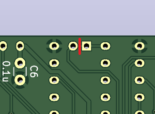

通常は容量は1MB(1024KB)固定となりますが、基板の裏側の2つのパターンの間の配線(図の赤線)をカットし、同じく裏側からキット付属の2mmピンヘッダ(ジャンパーピン付)を差し込み、表側からハンダ付けすることで、ジャンパピンを挿した状態で1024KB、抜いた状態で512KB、2つの容量に切り替えることができるようになります。512KB時のバンク割当は、0～63(128～191)にIC1のSRAMが見え、64～127(192～255)には何も(バンクのゴーストも)見えない、という状態になります。

こちらの改造ポイントは、表側に74HC32が被せられハンダ付けされてしまうので、ICより先に処理しておかないと、ハンダ付けするパターンがICの下に隠れてしまい、ジャンパピンを取り付けることができなくなってしまいます。また、カットする面にはジャンパピンが配置されているため、パターンカットする前にジャンパピンを付けてしまうと機能しません。

主にメガROMソフトの開発者向けの機能であり、似非RAMディスクとしてのみ使用するのであれば、改造の必要はありません。(なお完成品では改造済みの状態になっています)

### ② RAM減量(512KB化)

①は「1024Kと512Kを切り替えるジャンパ」の改造でしたが、こちらは「容量自体を512KBに減量する」改造です。当然ながらこちらの改造を行った場合、①のジャンパは意味が無くなります。

IC2のSRAMを実装しないことで容量を512KBにすることができます。またIC2に関連するC7とR2も外すことができます。バンク割当は①の512KB時と同様です。

単に部品を省略するだけなので、こちらの改造ポイントは、特に順序などに制限はありません。

### ③ ライトプロテクトスイッチ

通常はSRAMへは常時書き込み許可ですが、U2(74HC670)の6番ピンの裏面側から上方向に伸びている細いパターンをカットし(図の赤線・該当箇所の上部のみ基板の色が少し違います)、この6番ピンとU4(74HC00)の10番ピンの間にスイッチ(キットには付属していません)を付けることで、OFFで書き込み禁止、ONで書き込み許可となる、ライトプロテクトスイッチを付けることができます。

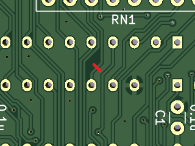

なお、こちらの改造ポイントは、パターンに重なる部品などは無いため、後からでも加工が可能です。

ただし、このライトプロテクトスイッチは、ソフトウェアからの書き込みに対しては有効ですが、ハードウェアが原因であるSRAM内容の消失に対しては無力です。書き込み禁止にしていたとしても、内容が消失する可能性はありますので、過度の期待はしないでください。

## 1. 裏面からの部品の取り付け(1)

本キットでは基板の面積の都合で、表面と裏面で重なる位置に部品が配置されているため、基板両面から部品の取り付けが必要です。ここでは、裏面(本来はハンダ面)からの取り付けが必要な部品について、取り付け手順を説明します。

### ① 抵抗の取り付け

抵抗のリードを抵抗の本体ギリギリのところで折り曲げ(キットの1/4W抵抗であれば丁度良い幅になるよう設計されています)、R1～R4のパターンに差し込み、テープなどで仮止めしてから、裏返して表面からハンダ付けします。抵抗は全て同じ抵抗値で、向きもありませんので、どれをどの向きに差し込んでも大丈夫です。

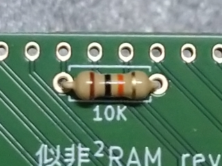

表面の部品と重なる部分については、ハンダを少なめにして、できるだけ盛り上がりのないようにハンダ付けし、余分なリードは基板面ギリギリのところでカットします。

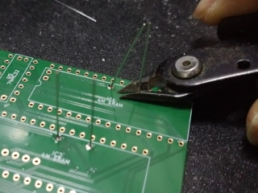

基板に抵抗を取り付けた状態です。

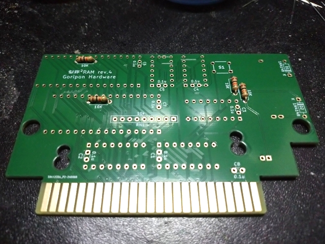

### ② ダイオードの取り付け

ダイオードのリードを折り曲げ(前項目の抵抗と同じくらいの幅になるようにします)、D1～D2のパターンに差し込み、テープなどで仮止めしてから、裏返して表面からハンダ付けします。ダイオードは青いラインの入っている側がK(カソード)ですので、基板上の白いシルク印刷の「K」と合わせて、向きを間違えないように差し込んでください。

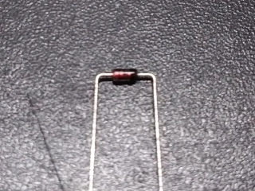
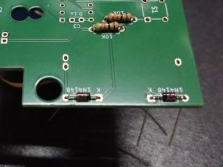

ダイオードは裏面に重なる部品が無いため、ハンダ付けは通常通りで構いません。ただし、あまりリードが長すぎるとボタン電池と干渉する可能性があります。

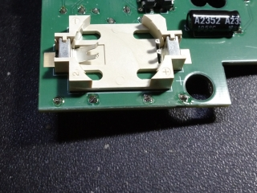

基板にダイオードを取り付けた状態です。

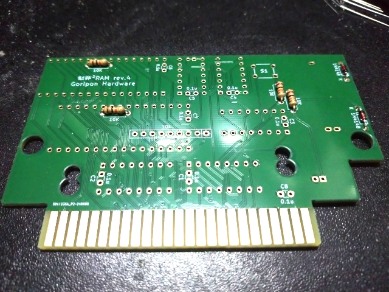

### ③ セラミックコンデンサの取り付け

セラミックコンデンサ(キットでは積層セラミックコンデンサ)は加工の必要はありません。リードの曲がりを直してそのまま差し込めばスポッと嵌ります。C1～C8のパターンに差し込み、テープなどで仮止めしてから、裏返して表面からハンダ付けします。

<!-- 要撮影：黒バック・セラミックコンデンサ差し込み -->
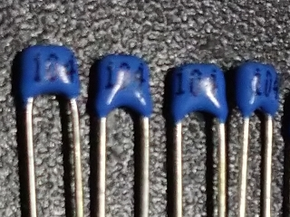

表面の部品と重なる部分については、抵抗と同様にハンダを少なめにして、できるだけ盛り上がりのないようにハンダ付けし、余分なリードは基板面ギリギリのところでカットします。

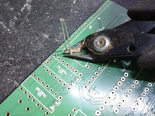

基板にセラミックコンデンサを取り付けた状態です。

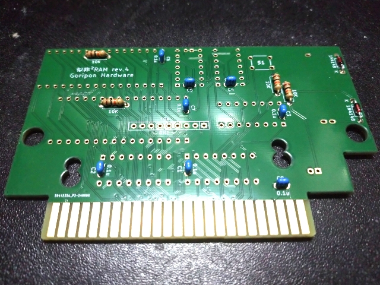

### ④ 集合抵抗の取り付け

集合抵抗は加工の必要はありません。集合抵抗の方向を間違えないようRN1のパターンに差し込み、テープなどで仮止めしてから、裏返して表面からハンダ付けします。集合抵抗の表面に印が印刷されている側が1番ピンになりますので、基板の白いシルク印刷で正方形に囲われた1番ピン側に合わせて、向きを間違えないように差し込んでください。

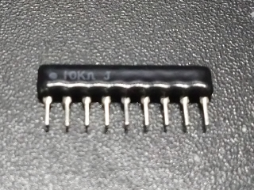
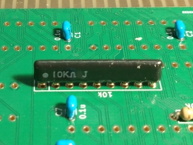

表面の部品と重なる部分については、抵抗と同様にハンダを少なめにして、できるだけ盛り上がりのないようにハンダ付けし、余分なリードは基板面ギリギリのところでカットします。

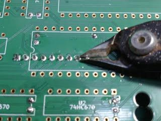

基板に集合抵抗を取り付けた状態です。

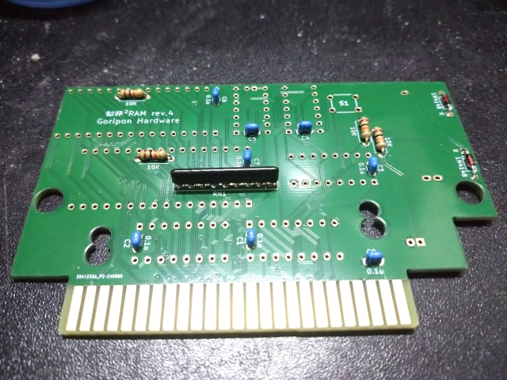

### ⑤ 1024KB/512KB切替ジャンパピンの取り付け

改造しない場合はこの項目は読み飛ばしていただいて構いません。

改造する場合は、ここで1024KB/512KB切替ジャンパピンのパターンをカットし(カット後にテスタなどで確実にカットされていることとGNDや+5Vとショートしていないことを確認しておくと安心です)、付属の2mmピッチピンヘッダ(ジャンパピン付)をパターンに差し込み、テープなどで仮止めしてから、裏返して表面からハンダ付けします。

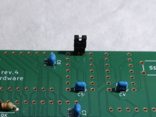

基板にジャンパピンを取り付けた状態です。

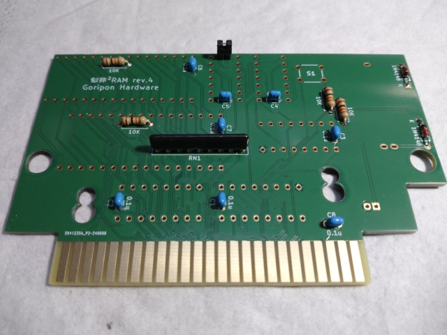

### ⑥ 裏面取付部品の確認

基板を裏面から見て、部品の付け忘れがないか、表面から見て、ハンダし忘れがないか、ハンダ部分やリードが必要以上に盛り上がったり残ったりしていないか、などを確認します。特に表面にICが重なる部品のミスは、ICを取り付けてしまった後では取り返しがつかないので、付け忘れとハンダし忘れは特に注意して確認してください。

なお、他の部品のハンダ付けの邪魔になるため、この時点ではタクトスイッチはハンダ付けしません。もし間違えて先にハンダ付けしてしまった場合でも、(取り付ける面を間違えていなければ)若干取り回しが悪くなるだけで特に問題はありませんので、そのまま進めてください。

## 2. 表面からの部品の取り付け

裏面の部品の取り付けが終わりましたので、引き続き通常通り、表面に部品を取り付けます。

### ① ICの取り付け

基板上のシルク印刷の印を見ながら、ICの向きを間違えないようU1～U5およびIC1～IC2のパターンに差し込み、テープなどで仮止めしてから、裏返して裏面からハンダ付けします。U1～U2はマークが右、U4～U5はマークが下、U3とIC1～IC2はマークが左、になっていますので注意してください。

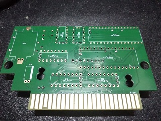
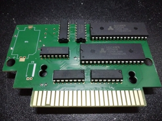

すでに裏面には抵抗・コンデンサ・ダイオードが取り受けられており、ハンダゴテをあてる際にも邪魔になることがありますので、適宜、基板の向きを変えてコテ先を当てやすい向きにして作業するようにしてください。

### ② ボタン電池ホルダの取り付け

ボタン電池ホルダの向きを間違えないようBT1のパターンに差し込み、テープなどで仮止めしてから、裏返して表面からハンダ付けします。コネクタ側がプラスになりますので、向きを間違えないように取り付けてください。

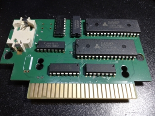

### ② 電解コンデンサの取り付け

電解コンデンサのリードをコンデンサの本体ギリギリのところで90°折り曲げ、C9のパターンに基板と並行になるように差し込み、テープなどで仮止めしてから、裏返して表面からハンダ付けします。電解コンデンサはマイナス側に印がついていますので、基板のシルク印刷で白い帯が描かれている側に合わせて、向きを間違えないように曲げて差し込んでください。

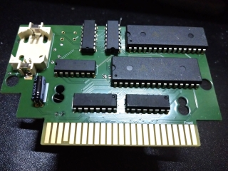

### ③ 表面取付部品の確認

基板を表面から見て、部品の付け忘れがないか、裏面から見て、ハンダし忘れがないか、などを確認します。

## 3. 裏面からの部品の取り付け(2)

最後にもう一度、基板を裏返して部品を取り付けます。

### ① タクトスイッチの取り付け

タクトスイッチは加工の必要はありません。タクトスイッチをS1ののパターンに差し込み(差し込むだけで固定されます)、裏返して表面からハンダ付けします。タクトスイッチは向きが間違っていると差し込めません(差し込めれば向きは関係ありません)。

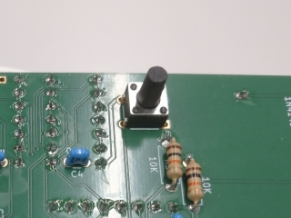

## 4. 全取り付け部品の最終確認

組み立ての最後に、すべての部品が正しく取り付けられているかどうかを確認します。

表面から見て、電解コンデンサ・ボタン電池ホルダ・各種ICが、向きも含め正しく取り付けられているかどうか、裏面の部品のハンダ付けが(この時点ではほとんど見えないと思いますが…)正しく行われているかどうか、を確認してください。

裏面から見て、抵抗・ダイオード・セラミックコンデンサ・集合抵抗・タクトスイッチ(改造した場合はジャンパピンも)が、向きも含め正しく取り付けられているかどうか、表面の部品のはんだ付けが正しく行われているかどうか、を確認してください。

