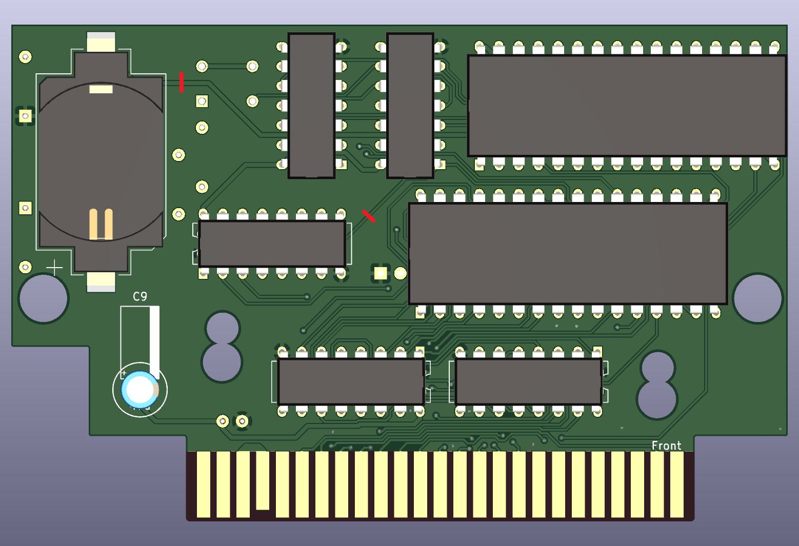
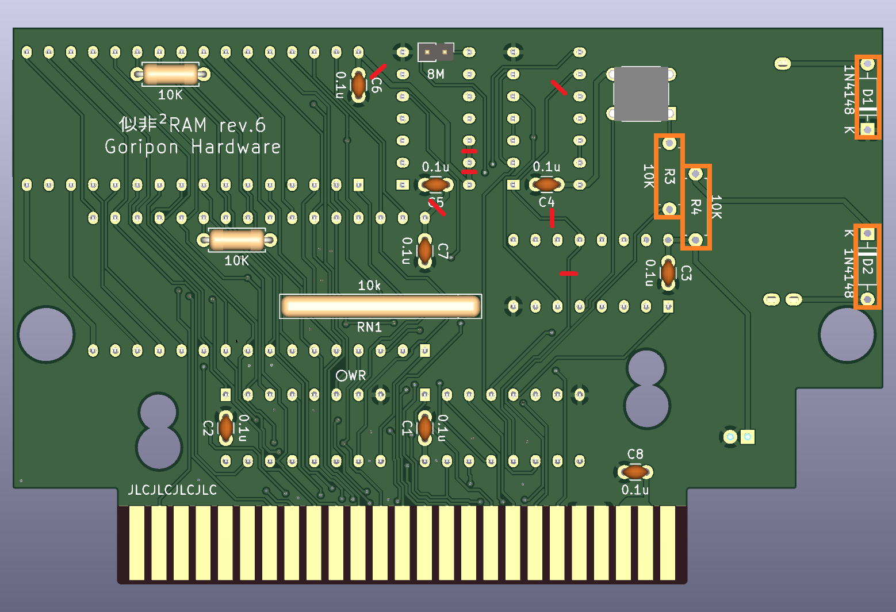
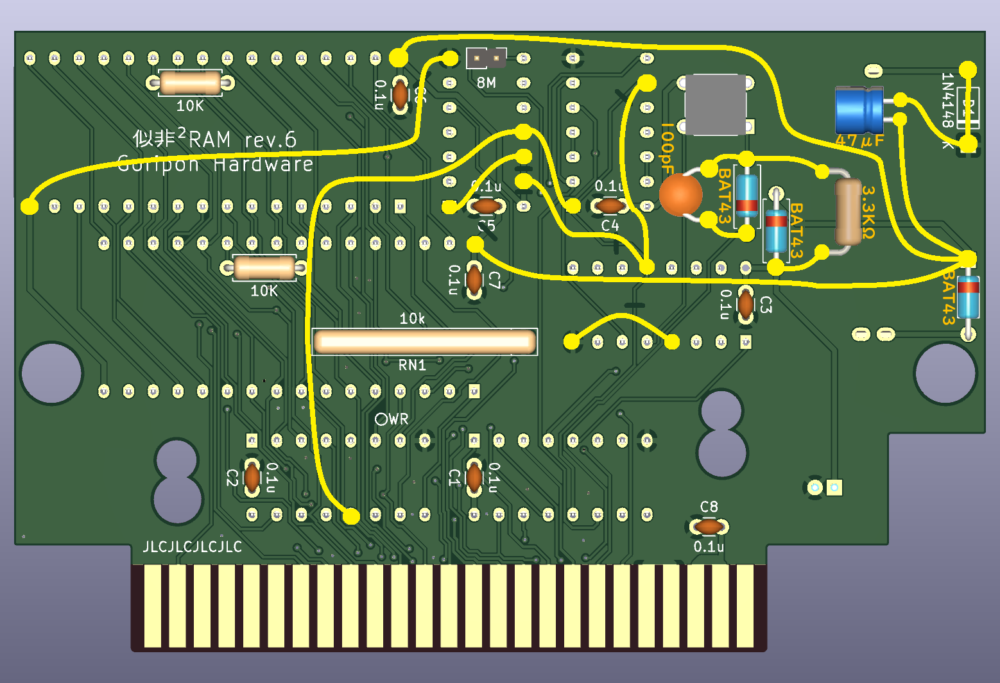
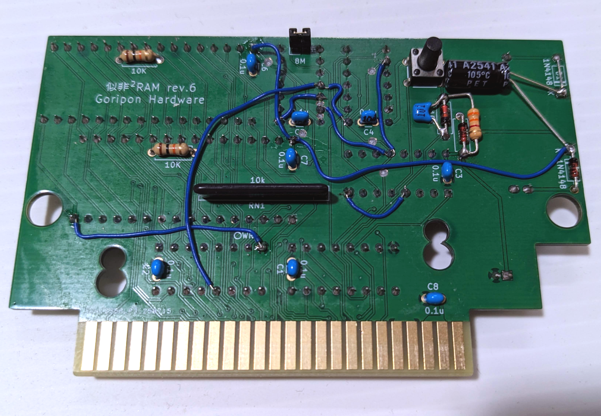

# 基板改修情報

Rev.6以前の基板をRev.7相当の回路に改修するための情報です。
Rev.6以前の基板はMSX本体に負担を掛ける回路でしたので、この改修を行うことを強く推奨します。
 これにより、回路はRev.7と同等になり、本体への負担軽減のほか、電池保ちが改善され、互換性が向上します。

なお、実際の改修はRev.4～Rev.6の基板で検証しています。Rev.3以前の基板の場合は、同じ手順で改修出来ない可能性があります。

## 部品表
|内容|数量|
|:--|--:|
|抵抗 3.3KΩ・1/4W|1|
|ショットキーバリアダイオード BAT43 ※代替品になる場合は順方向電圧(Vf)の低いダイオード(通常はショットキーバリアダイオード)を選択してください|3|
|積層セラミックコンデンサ 100pF・50V|1|
|電解コンデンサ 47μF・6.3V以上|1|
|ジャンパ用配線|適宜|

## 改修手順

実際の改修手順です。

1. パターンカット 基板表面
 パターンカットを行います。
 画像の赤線(2ヶ所)のパターンをカットします。

2. パターンカットと部品撤去 基板裏面
 表面と同様にパターンカットと、加えてD1、D2、R3、R4の撤去を行います。
 画像の赤線(7ヶ所)のパターンをカットし、橙線で囲われている部品を外します。

3. 部品取付とジャンパ配線 基板裏面
 以下の実体配線図をもとに部品を載せて、配線材でジャンパを飛ばします。
 R3、R4はダイオードBAT43(向きは画像を参照)に換装、D2も同じくBAT43(向きは元と同じ)に換装、D1には部品は載せず配線で繋いでバイパスします。
 100pFの積層セラミックコンデンサは、元R3の場所に載せたBAT43と並列になるように繋ぎます。
 47μFの電解コンデンサは、マイナス側を元D1のカソード(GND)に、プラス側をD2のカソードに繋ぎます。R3・R4付近の横のラインにはケース内側の凸部が来るので、電解コンデンサを置いてしまうとケースが閉まらなくなる可能性がありますのでご注意ください。

## 実際の改修例

こちらで実際に改修して検証したものの写真になります。
 ちなみに、パターンカットは該当箇所をドリルで抉ってカットしています。
 実体配線図では、配線が重なって見難くならないよう、この写真とは違う場所・違う経路で接続しているピン(SRAMのVCC/GND)があります。

