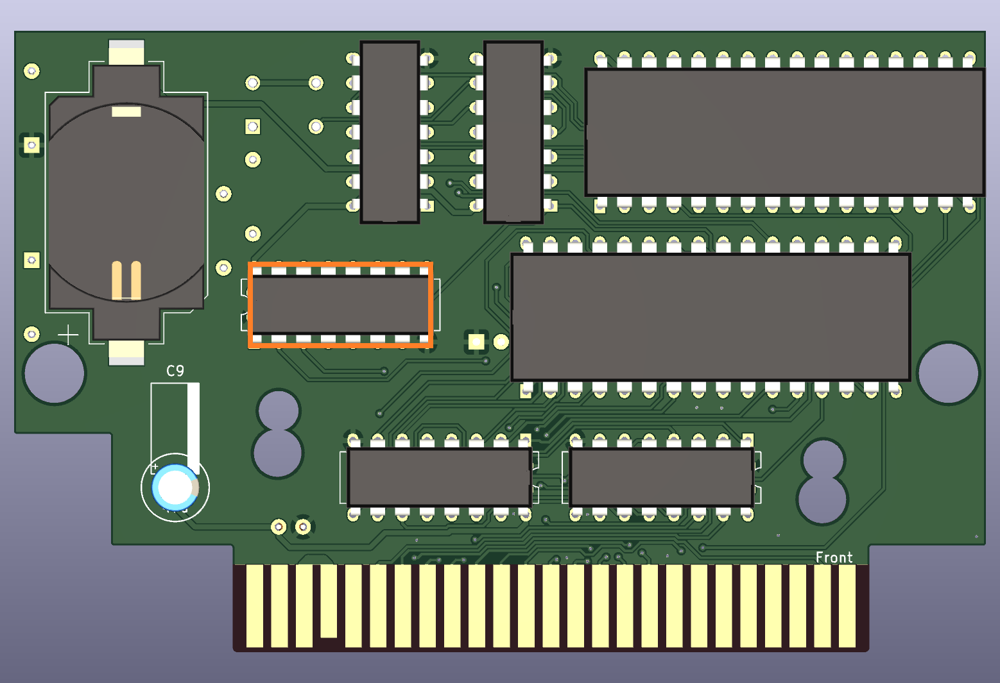
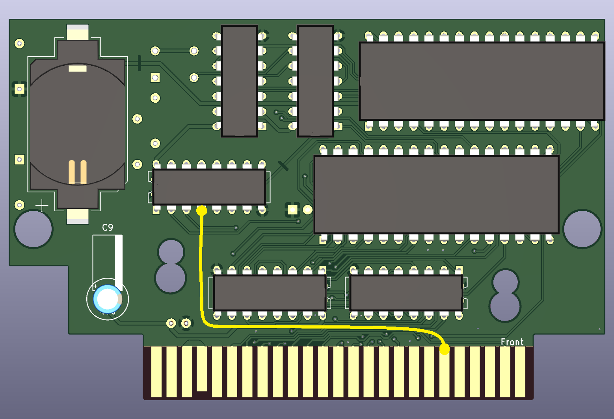
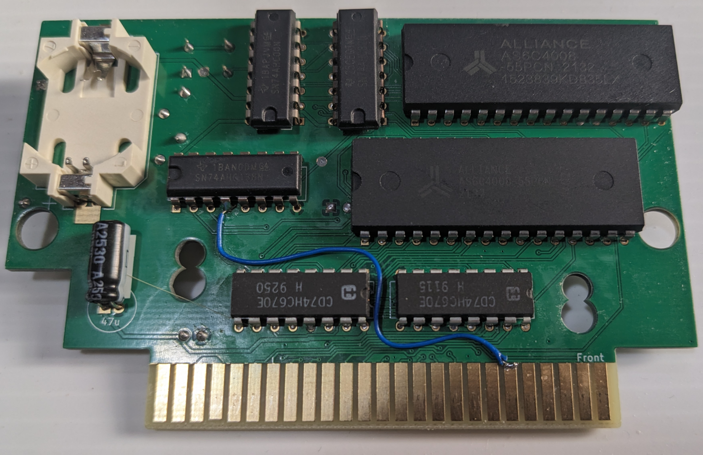

# 基板改修情報

Rev.6以前の基板をRev.7相当の回路に改修するための情報です。
Rev.6以前の基板はMSX本体に負担を掛ける回路でしたので、この改修を行うことを強く推奨します。
 これにより、回路はRev.7と同等になり、本体への負担軽減のほか、電池保ちが改善され、互換性が向上します。

改修には、ジャンパ・パターンカット・ディスクリート部品搭載によりRev.7相当の回路にする基板へのパッチあてと、IC載せ替えの2段階があり、どちらか片方だけを行う、もしくは両方行う、合わせて3通りの改修方法があります。
 ただし、前者のパッチあてはICの足にジャンパやディスクリート部品をハンダ付けする都合上、先にパッチを行った場合は一旦取り付けたパッチを外さなければいけない場合があるため、ICの交換を行う場合は先に行うことを推奨します。

>[!IMPORTANT]
>実際の改修はRev.4～Rev.6の基板で検証しています。Rev.3以前の基板の場合は、同じ手順で改修出来ない可能性があります。

## 部品表

|内容|数量|
|:--|--:|
|抵抗 3.3KΩ・1/4W|1|
|抵抗 10KΩ・1/4W ※撤去したものを再利用する場合は不要|1|
|ショットキーバリアダイオード BAT43 ※代替品になる場合は順方向電圧(Vf)の低いダイオード(通常はショットキーバリアダイオード)を選択してください|5|
|積層セラミックコンデンサ 100pF・50V|1|
|電解コンデンサ 47μF・6.3V以上|1|
|ロジックIC "74ACT138" ※ICを換装する場合|1|
|ジャンパ用配線|適宜|

## 改修手順

実際の改修手順です。

0. IC換装
 U3を撤去して、用意しておいたACTファミリーのICに換装します。
- 橙線で囲われている部品(1ヶ所)を撤去し、74AHC138から74ACT138に換装します。
- ICの換装により最大限の互換性が得られますが、通常ICの換装までは必要ありません。標準的なMSXより高速で動作する機種(FS-A1FX/WX/WSXの5.37MHzモード・HC-90/95ターボモード等)や、バスタイミングが標準的なMSXと異なる機種(1chipMSX系・HC-90/95等)、信号の駆動電圧が標準的なMSXと異なる機種(1chipMSX系)であれば、改修のみに比べ互換性が更に向上する可能性がありますので、使用する本体に合わせ適宜選択してください。

1. パターンカット(基板表面)
 パターンカットを行います。
- 画像の赤線(2ヶ所)のパターンをカットします。

2. パターンカットと部品撤去(基板裏面)
 表面と同様にパターンカットと、加えてD1、D2、R1、R3、R4、ジャンパピンの撤去を行います(1024KB/512KB切替ジャンパピンはこの改修で使えなくなります)。
- 画像の赤線(9ヶ所)のパターンをカットし、橙線で囲われている部品(6ヶ所)を撤去します。
- 判り難いですが、R1左側(左側パッドとICのピンの間)と、ジャンパピンの間(ジャンパピンが取り付けられている場合はカット済)にもカットする場所がありますので、ご注意ください。

3. ジャンパ配線(基板表面)
 以下の実体配線図をもとに、配線材でジャンパ(1配線)を飛ばします。
- カードエッジコネクタの端子へのハンダ付けになるため、耐熱テープで端子を覆うなどして、ハンダがあまり流れないよう注意して作業してください。

4. 部品取付とジャンパ配線(基板裏面)
 以下の実体配線図をもとに部品(9ヶ所)を載せて、配線材でジャンパを飛ばします。
- R1左側パッドにBAT43のカソード側を接続、BAT43のアノード側はSRAMの22ピン(R1左側パッドのすぐ上)に接続、R1右側パッドには10KΩの抵抗の片方を接続、抵抗のもう片方はBAT43のアノード側に接続します。
- R3、R4はダイオードBAT43(向きは画像を参照)に換装、D2も同じくBAT43(向きは元と同じ)に換装、D1には部品は載せず配線で繋いでバイパスします。
- ジャンパピンの左側パッド(四角のシルク印刷がある側)にBAT43のアノードを接続、右側パッドにBAT43のカソードを接続します。縦に取り付けるとケースに収まらなくなるため、寝かせて取り付けてください。
- 100pFの積層セラミックコンデンサは、元R3の場所に載せたBAT43と並列になるように繋ぎます。
- 47μFの電解コンデンサは、マイナス側を元D1のカソード(GND)に、プラス側をD2のカソードに繋ぎます。R3・R4付近の横一帯のエリアにはケース内側の凸部が来るため、電解コンデンサを置いてしまうとケースが閉まらなくなる可能性がありますので、ご注意ください。
- 実体配線図左端のSRAMのピンの接続はGNDへの繋ぎ替えなのでGNDであればどこでも問題なく、実体配線図では近くのベタGNDのレジストを削って繋いでいます。

## 実際の改修例

こちらで実際に改修して検証したものの写真になります。

